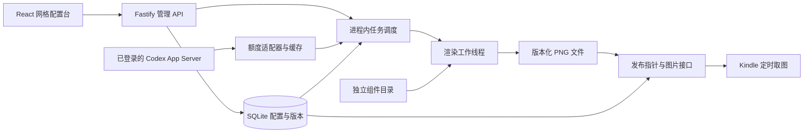

# InkStack 技术架构方案

状态：首版软件已实现并进入本地验收（2026-09-05）。下文保留原设计约定；实际交付范围、命令和验证证据以 [验收记录](verification.md) 与 [部署说明](deployment.md) 为准，Kindle 实机仍待验证。

## 1. 目标与部署形态

InkStack 提供一个网页网格编辑器，按组件配置生成 PNG，再由 Kindle 定时获取。首版是单用户、单看板、单目标屏幕，包含文字、日期、待办和 2×4 Codex 额度组件。

推荐“统一 TypeScript + npm workspaces + 模块化单体”：

- React 配置台构建为静态文件。
- 一个 Node.js 后端进程提供网页、管理 API、图片接口和定时任务。
- 进程内一个长期复用的渲染工作线程，承担 CPU 密集的绘制与图像处理。
- SQLite 存放配置与发布元数据，PNG 存放本地数据目录。
- 同机连接 Codex App Server 是首版优先路径；独立采集器仅在跨主机部署确有需要时增加。

这些是同一项目内的模块，不拆成微服务，不部署 Redis、消息队列或独立数据库服务器。Kindle 客户端继续使用现有项目，不 fork。

## 2. 建议技术栈

| 层 | 建议 | 用途与取舍 |
| --- | --- | --- |
| 语言与仓库 | TypeScript 严格模式、npm workspaces | 前后端共享契约；一份锁文件，不引入额外任务编排工具 |
| 管理前端 | React + Vite + CSS | 编辑器是客户端应用，不需要服务端页面渲染 |
| 编辑状态 | React useReducer/context | 管理选中、拖动、草稿、撤销；首版暂不增加全局状态库 |
| 网格交互 | CSS Grid + Pointer Events + 共享网格纯函数 | 控制指定尺寸和禁止重叠；键盘/表单操作并行支持 |
| 服务端 | Node.js 24 LTS + Fastify | HTTP、静态资源、请求校验、日志与接口测试 |
| 配置契约 | JSON Schema Draft 7 + Ajv | 与组件文件夹中的 schema 一致；前后端使用相同校验语义 |
| 图片绘制 | SVG + @resvg/resvg-js | 支持文字与图形，生产端不运行 Chromium |
| 图片处理 | sharp | 白底合成、去透明、单通道灰度与 PNG 编码 |
| 存储 | SQLite + better-sqlite3，SQL 迁移 | 单实例的小规模配置/元数据；首版不增加 ORM |
| Codex 接入 | App Server JSON-RPC 只读适配器 | 读取账号额度快照，凭据保留在登录主机 |
| 验证 | Vitest、Fastify inject、Playwright | 纯逻辑/服务测试、真实浏览器编辑器流程；Playwright 只用于开发验证 |

精确包版本在脚手架阶段核对兼容性并写入锁文件，不在本规划中猜测版本。原生依赖需在目标平台验证；运行环境不直接沿用当前电脑上任意版本的 Node。

依据：[Node 发布周期](https://nodejs.org/en/about/previous-releases)、[React 应用构建](https://react.dev/learn/build-a-react-app-from-scratch)、[Vite](https://vite.dev/guide/)、[Fastify](https://fastify.dev/docs/latest/Reference/Validation-and-Serialization/)、[Ajv](https://ajv.js.org/json-schema.html)、[better-sqlite3](https://github.com/WiseLibs/better-sqlite3)、[resvg-js](https://github.com/thx/resvg-js)、[sharp 色彩处理](https://sharp.pixelplumbing.com/api-colour/)。

## 3. 系统数据流



浏览器不接触 Codex 认证信息。传给工作线程的消息只包含配置、数据快照、时间、主题和经过校验的资源，不传认证信息。线程用于分离计算负载，不是安全沙箱；首版只运行项目中受信任的组件代码。

## 4. 网格编辑器

持久化 columns、rows、外边距、间距，以及每个实例的 column、row、columnSpan、rowSpan。像素区域仅由 shared/grid.ts 计算，不保存第二份像素坐标。

CSS Grid 表达格子结构；逻辑画布按目标屏幕尺寸计算，通过整体缩放适应浏览器。指针坐标必须除以显示缩放比例后再换算格子，不能将 CSS 显示像素当成设备像素。

Pointer Events 负责指针捕获、拖动和取消；共享逻辑负责吸附、边界、碰撞和允许尺寸。无效放置回退，不移动其他组件。首版通过明确的尺寸选项实现改尺寸，缩放手柄只是同一操作的补充。

React reducer 保存编辑态和会话内撤销栈。远程数据通过薄 API 客户端访问；保存和发布有明确状态。预览请求携带 editorRevision，旧响应不能覆盖新编辑态。

最终画面预览是服务端 PNG。拖动时先显示位置框，落点稳定后合并预览请求；不为每一个指针事件生成图片。

备选 react-grid-layout 更适合需要自动压缩、挤开与响应式重排的仪表盘；本项目当前明确禁止这些默认行为，因此先用较小的专用交互层。若触摸/无障碍维护成本超过预期，再评估交互库，不改变持久化网格模型。

## 5. 组件契约和执行边界

保持 [一组件一目录](widgets.md)，使用以下类型契约组织工作，不增加独立的插件平台或 SDK：

- 公共描述：manifest、config schema、defaults。
- 可选连接描述：connection.schema.json，声明入口、认证方式和秘密输入字段。
- 可选后端取数：server.ts。
- 纯绘制：render.ts，接收固定输入，输出受控 SVG 片段。
- 必要时拆分尺寸布局：views。
- 验证样例：fixtures。

组件只在自身局部坐标区域绘制；平台使用裁剪区域并合成整张 SVG。文本必须转义，图像仅引用平台准备好的内容，组件不能从 SVG 自行读取外部 URL 或本地路径。

组件设置支持创建/选择数据连接、填写服务入口及所需密钥、测试和保存。连接设置独立于显示配置；平台保存版本化连接和加密凭据，看板仅引用连接及版本。具体字段、秘密写入、目标限制、共享影响和验收见 [组件连接配置](component-connections.md)。

同一组件增大后可以重新排版。例如 Codex 首版只声明 2×4，文字与待办声明多个离散尺寸。长文本有行数限制和截断提示，不通过无限缩小字号塞入内容。

catalog.ts 是纯元数据；registry.server.ts 是服务端执行注册。组件模块导入本身不得启动网络请求或读取凭据。渲染工作线程只调用绘制入口，数据获取在主线程的适配器层完成。

schema 是配置约束的唯一运行时来源，TS 类型不能代替校验。采用明确的字段子集构建通用配置表单；不承诺支持任意 JSON Schema 自动生成复杂表单。Ajv 关闭静默类型转换、删除未知字段和自动写默认值，默认配置只在新增实例时显式应用，错误配置必须给出错误。只编译项目注册的可信 schema，不接受用户上传 schema 后执行编译。

## 6. PNG 渲染

推荐流水线：

```text
配置校验 → 获取/复用数据快照 → 计算网格区域
→ 合成 SVG → resvg 栅格化 → sharp 白底合成和灰度编码
→ 校验 PNG → 计算 SHA-256 → 交给发布服务
```

输出要求：目标宽高、8-bit 单通道灰度、无 alpha、非动画 PNG。sharp 的 greyscale 默认仍可能保留三通道，实施时需明确输出 b-w 色彩空间，并检查最终 PNG 元数据，不能只凭看起来黑白判断格式。

字体使用固定打包资源，先验证中文长文本、数字、换行和 Codex 2×4 画面。字体选择和授权记录属于技术预研验收。渲染版本应包含组件、字体和渲染器版本，便于追踪画面变化。

resvg 的同步计算放在长期复用的 worker thread 中；首版并发数为 1。有界任务列表合并重复请求，手动发布优先于周期更新，过期预览可以丢弃。任务超时后标记失败并回收工作线程；终止原生计算的实际行为需要在预研中验证，若线程无法可靠回收再改用子进程隔离。

网络请求继续用 Node 的异步 I/O，不把整个后端业务搬进工作线程。图片 GET 只读取已发布文件，不调用渲染器或数据源。

依据：[Node worker_threads](https://nodejs.org/api/worker_threads.html)、[sharp 色彩处理](https://sharp.pixelplumbing.com/api-colour/)。

## 7. 存储和发布一致性

建议的数据结构：

| 表/存储 | 保存内容 |
| --- | --- |
| dashboards | 当前草稿 JSON、draftRevision、已发布配置 JSON、发布修订和图片引用 |
| snapshots | 图片哈希、文件名、尺寸、配置修订、生成时间、数据状态 |
| render_jobs | 任务类型、输入修订、排队/运行/完成/失败/被替代状态 |
| data_sources / data_source_versions | 来源（即数据连接）类型、别名、入口、版本和凭据引用；不保存 Codex 登录 token |
| credentials | 数据适配器所需秘密的密文、加密元数据、修订与引用；部署主密钥另存 |
| data_cache | 按来源、账号身份和额度分组等条件隔离的数据及实际采集时间 |
| data/images/ | 以内容摘要命名的已校验 PNG |
| data/tmp/ | 尚未发布的渲染文件，重启后可清理 |

组件实例作为看板 JSON 的一部分存储，不把一个组件拆成多张业务表。SQL 迁移按版本管理，写入使用短事务和参数化语句。SQLite 仅有一个后端写入者，不支持在多个容器间通过共享盘并发写入。

发布顺序：

1. 读取并固定请求指定的草稿修订，登记发布任务及发布请求序号。
2. 获取数据并生成完整 PNG，写入临时文件。
3. 校验尺寸/格式，完成文件写入后移入按哈希命名的位置。
4. 在数据库事务中检查该任务仍是有效发布请求；同时切换已发布配置、snapshot 引用和任务状态。
5. 请求被较新的发布替代时，旧任务不能改动发布指针。未引用文件留待清理。

周期更新只依据已发布配置；提交时检查其发布修订仍与任务输入一致。草稿的新编辑不影响当前周期更新。

同一看板串行执行，预览永远不进入发布指针。数据库提交失败、进程中止或渲染失败，都应保留上一版本。重启后将运行中任务标记中断，并只为当前发布状态安排必要更新；旧任务不盲目重跑。

清理图片时保留当前版本、最近一个有效版本和有宽限期的未引用文件，不删除仍被任务引用的文件。备份应使用一致的 SQLite 备份与图片集合；首版可以停服务备份整个数据目录。

## 8. API 与访问方式

建议的接口：

| 方法与路径 | 职责 |
| --- | --- |
| POST /api/session | 管理员登录 |
| DELETE /api/session | 退出 |
| GET /api/widget-types | 公共组件定义和可配置字段，仍属于管理 API |
| GET /api/dashboards/:id | 当前草稿、修订和发布状态 |
| PUT /api/dashboards/:id/draft | 保存带 baseRevision 的草稿，冲突返回 409 |
| POST /api/dashboards/:id/preview | 校验请求中的临时配置及 editorRevision，返回预览任务 |
| POST /api/dashboards/:id/publish | 指定已保存 draftRevision，创建发布任务 |
| GET /api/jobs/:id | 查询任务和结果；首版用轮询 |
| GET /api/previews/:jobId.png | 获取已完成预览，要求管理会话 |
| GET /api/data-sources | 来源状态与分组等脱敏元数据 |
| POST /api/data-sources | 创建连接及首个版本，秘密仅写入，响应不回显 |
| POST /api/data-sources/:id/versions | 创建入口/认证模式等设置的新版本 |
| POST /api/data-sources/test | 测试未保存输入或指定连接版本，不修改草稿或发布状态 |
| PUT /api/data-sources/:id/credentials/:credentialId | 显式 keep/replace/clear，验证归属；轮换后失效关联缓存 |
| DELETE /api/data-sources/:id | 删除无引用连接；仍被使用时拒绝 |
| POST /api/data-sources/:id/refresh | 限频的手动读取，复用在途请求 |
| GET /display/:displayToken.png | 客户端兼容的稳定图片地址 |
| GET /healthz | 最小存活状态，不泄漏账户或配置 |

首版单管理员登录：启动时从环境或受权限保护的配置获得管理员凭据，采用密码哈希比较与服务器会话；cookie 为 HttpOnly、SameSite，并在 HTTPS 部署时 Secure。管理变更接口校验来源，登录与手动采集限频。具体 session 插件在实施时核对，不自制密码学。

连接与凭据接口同样要求管理员会话。浏览器只在录入新秘密时持有输入值，保存后清除；禁止 GET 读取已保存秘密。账号登录凭据与通用组件 API 密钥采用各自适配方式，不将 Codex 认证文件导入通用密钥表。

图片 URL 使用独立高熵随机令牌，不使用可枚举的看板 ID，数据库只保存令牌摘要。它是持有者即可访问的只读地址，不是正式设备登录；日志需要遮盖 URL 中的令牌。支持管理端轮换，轮换后要更新 Kindle 的配置。

管理界面通过会话访问，Kindle 使用独立图片地址，不需要浏览器 cookie 或额外自定义 header。令牌原文仅在创建/轮换时返回；后续页面显示脱敏状态，丢失时重新生成。

图片返回 image/png、强 ETag、要求重新验证的 Cache-Control；If-None-Match 命中时返回 304。未知令牌返回 404，尚无有效图片返回 503。错误不能伪装为 PNG。

默认按可信局域网部署设计；HTTP 不提供传输保密。需要公网时使用 HTTPS，并先确认目标 Kindle 的 TLS 兼容性；不能为设备降级整个管理后台的保护。

## 9. Codex 额度采集

通过 Codex App Server 完成 initialize 握手后，只调用 account/rateLimits/read；可以消费额度更新通知，但首版定时读取即足够。传输是主机内 JSON-RPC，不是把 App Server 端口直接公开给浏览器。

主线程的 connectors/codex-app-server.ts 管理连接、请求 ID、超时和退出；codex-usage/server.ts 负责所选来源的额度适配，normalize.ts 负责字段转换，render.ts 只绘制快照。请求命令路径由部署配置决定，不能从看板 JSON 拼接任意 shell 命令。

推荐首版同机部署，使用该主机已配置的合适 Codex 登录环境。若服务部署在 NAS 而登录环境只在电脑，后续可以增加电脑采集器，通过经认证的接口发送最小额度快照；电脑关机时额度显示过期，其他本地组件照常工作。此分支是额外工作，不能假设已经提供。

按实际分组和窗口展示，剩余百分比由已用比例换算；缺失不是 0，重置时间过了也不能自行认定恢复额度。多账号/分组缓存隔离；认证身份变化后清理旧身份映射。账号的真实登录态与数据可用性必须在开发早期验证，模拟图不能作为接入证明。

来源快照记录 observedAt，图片另记录 generatedAt。重画旧数据时不得把 observedAt 更新成当前时间。第一版不使用充值、消费重置次数或修改登录态的方法。

依据：[官方 App Server 文档](https://learn.chatgpt.com/docs/app-server)，具体 UI 及状态见 [Codex 组件](../packages/widgets/src/codex-usage/README.md)。

## 10. 目录和构建

延续现有 apps/web、apps/server、packages/shared、packages/widgets；具体文件见 [文件结构](project-structure.md)。

推荐工作区名 @ink-stack/shared、@ink-stack/widgets、@ink-stack/server、@ink-stack/web。公共包为 ESM，tsc 生成可导入的产物；服务端用 tsc 构建，网页用 Vite。组件 manifest、schema、fixtures 及字体不是编译后自动存在的资源，构建流程需要显式复制必要文件并验证工作线程路径。

根命令 dev、build、typecheck、test、start 已创建。dev 构建后启动单服务，start 启动后端并提供已构建网页。

生产优先普通 Node 服务；目标主机确定后再补 Docker。使用 Debian/glibc 系基础镜像作为容器起点，减少原生依赖适配变量；不能承诺尚未验证的 NAS 架构或 ARM 包可直接运行。

## 11. 实施步骤与验收

### A. 两项技术预研

在本地临时验证渲染链路和 Codex 读取契约，再建立依赖锁文件。

- 渲染：目标分辨率下生成包含中文长文本和 2×4 额度卡片的 PNG，检查宽高、灰度通道、透明度和裁剪。
- Codex：验证所选主机版本与认证可读取额度，并核对至少一个真实分组；不可用时报告具体原因，不伪造数据。
- 验证 Node、resvg、sharp、SQLite 绑定能在目标部署平台安装和加载；检查 worker 路径及超时恢复。
- 设备未知时先做可配置分辨率样例，明确实机验证尚未完成，不因此停止服务器基础工作。

### B. 工作区与基础模块

建立 package 工作区、共享 schema/网格函数、组件注册、Fastify 基础路由、SQLite 迁移和渲染线程。

验收：全新安装可构建；默认配置和注册表通过校验；整数坐标、支持跨度、无重叠、余数像素分配有测试；前端产物不含服务端取数入口或凭据。

### C. 编辑与发布链路

实现文字/日期/待办，组件库与网格编辑，草稿保存、实际预览、发布与 PNG 接口。

验收：两个相同类型实例可独立配置；缩放后的拖动与键盘操作一致；冲突回退；临时预览不改发布图；旧预览响应被忽略；修订冲突返回 409；发布失败/乱序/重启保持有效旧图。

### D. Codex 2×4 与周期刷新

接入真实额度适配、来源状态、去重采集、缓存和已发布看板定时渲染。

验收：已用25%显示剩余75%；未知不显示0%；单窗口、多分组、登录失效、过期、跨过重置时间和账号切换均正确；同来源多组件不重复请求；不创建模型任务或消费重置额度。

### E. 部署和设备验证

验证静态资源、登录/图片令牌边界、备份恢复及目标设备。

验收：未登录不能修改配置或取到管理数据；错误图片令牌不返回画面；条件请求正确返回304；取图不触发新渲染；渲染忙时现有图片与健康接口仍能响应；Kindle 至少完成三轮定时唤醒显示及一次断网恢复。长期续航单独测量。

## 12. 风险与验证重点

| 风险 | 处理 |
| --- | --- |
| 原生渲染与 SQLite 绑定不兼容部署架构 | 在 A 阶段确认平台并做安装/加载验证，先固定 Node LTS 与锁文件 |
| SVG 中文排版或尺寸布局不满足预期 | 中文字体和长文本预研；若核心组件无法满足，再整体切换浏览器截图，不维护两套首版渲染器 |
| 图片任务阻塞服务或退出不可靠 | 单渲染线程、有界队列、超时实验，必要时使用子进程隔离 |
| 文件与数据库状态不一致 | 先完整落文件、后事务切换指针；重启/故障注入验收 |
| Codex 登录与服务不同主机 | 默认同机，明确独立采集器分支；缓存标注真实采集时间 |
| 组件把敏感信息传给浏览器 | 公共/后端导出隔离，只传最小快照，构建产物检查 |
| 拖拽库行为改变配置布局 | 共享纯函数作为最终裁决，后端重复校验，禁止隐式重排 |

## 13. 决策记录

采用 TypeScript 单体：共享组件与网格契约，适合当前单看板规模。暂不采用 Next.js SSR、微服务、Redis 或 ORM，因为当前交付目标不需要它们。

采用 SVG/resvg + sharp：优先服务资源与可控输出。HTML/React 截图更方便复用网页组件，但引入浏览器运行与就绪管理；若中文或复杂布局预研失败，将重新评估整条路径。

采用独立目录、显式注册：允许开发者扩展组件，代价是新增后需要重新构建。在线插件市场和运行用户上传代码不进入首版。

采用 SQLite + 本地 PNG：部署简单，代价是首版限定单写入实例，并需要一致的备份策略。

尚需用户环境信息：目标部署主机、Kindle 型号/固件、Codex 登录是否同机。这些影响部署验证，不阻塞通用模块的实现规划。
